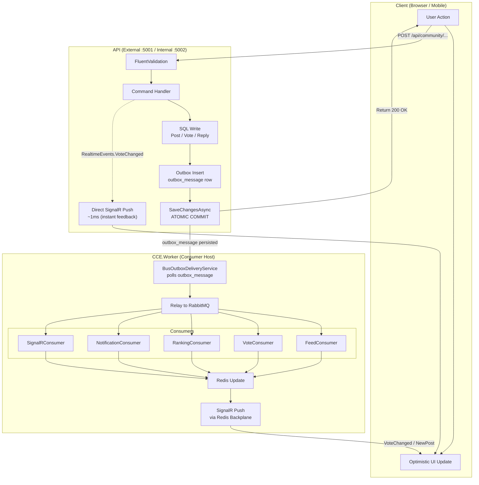
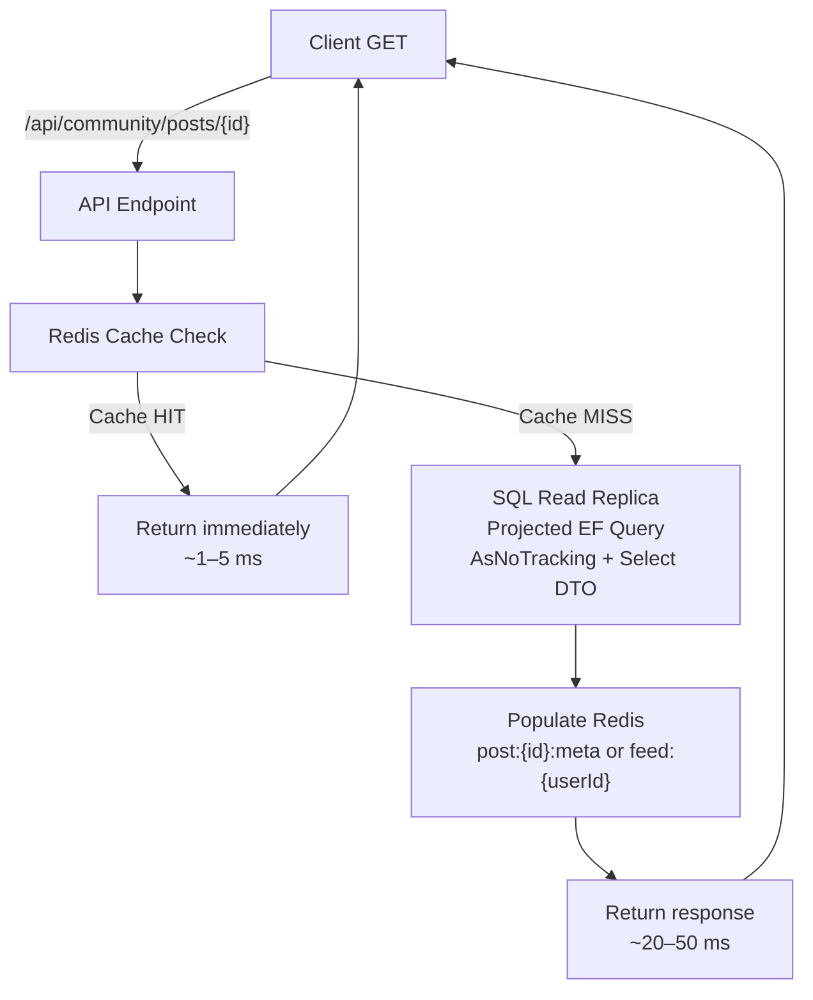
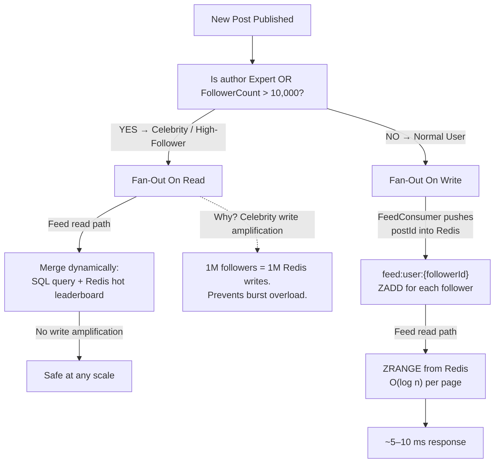
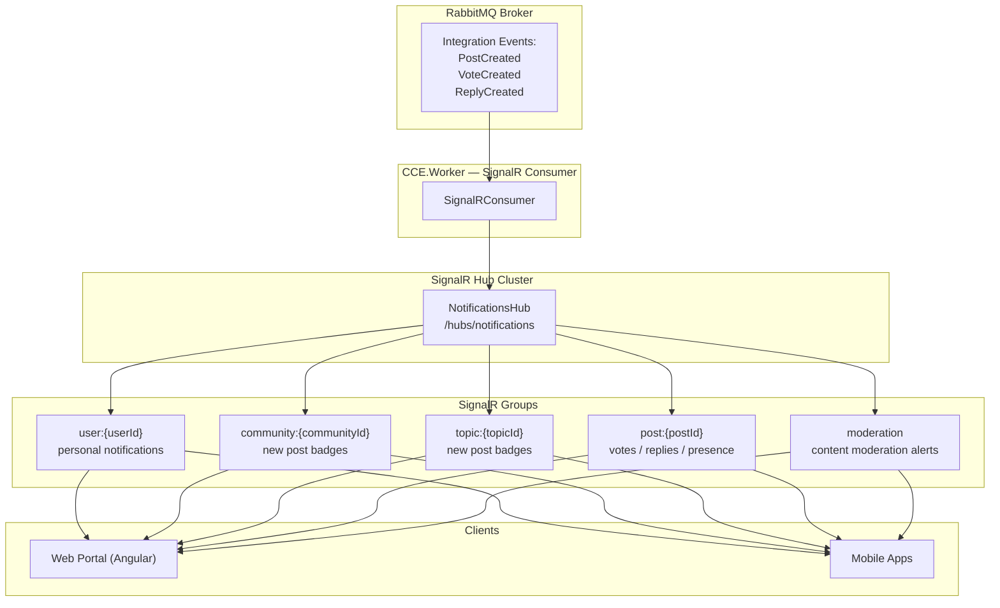
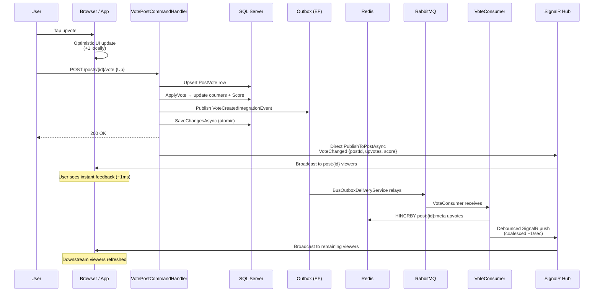
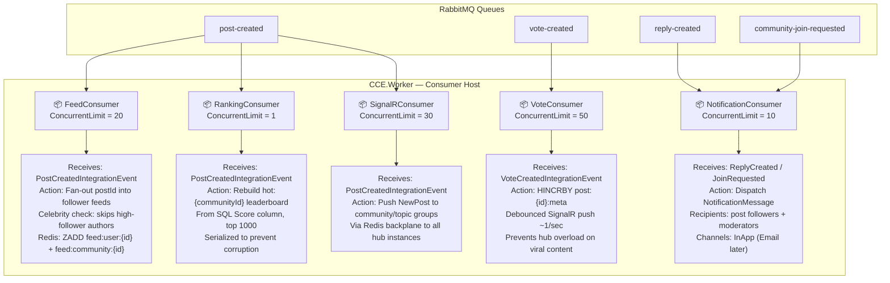

# Spring 9 — Real-Time Community Architecture

> **Status:** Implemented and building (source projects compile; integration pending EF migration).  
> **Last updated:** 2026-06-08  
> **Scope:** MassTransit + RabbitMQ outbox, SignalR + Redis backplane, hybrid fan-out feed strategy, hot counters, and 5 new consumers in `CCE.Worker`.

---

## 1. Write Path Flow

**Key principle:** The API returns `200 OK` immediately after the atomic SQL + outbox commit. All heavy downstream work (feed fan-out, ranking rebuild, bulk notifications) happens **asynchronously** in the Worker. Downstream systems are **eventually consistent** — Redis counters may lag SQL by ~1 second under normal load, and feed fan-out by ~1–5 seconds.

---

## 2. Read Path Flow

**Cache rules (from §11.1 of sprint-09 plan):**

| Surface | Cache Strategy | TTL |
|---|---|---|
| Anonymous public feeds / topics / communities | Output cache (`out:` prefix) | 60 s |
| Authenticated personal feed (`feed:{userId}`) | Redis ZSET | 24 h |
| Single post detail (anonymous) | Output cache | 30 s |
| Post detail (authenticated, carries "my vote") | **Not cached** | — |
| Private community content | **Never cached** | — |

---

## 3. Hybrid Fan-Out Feed Strategy

**Celebrity write amplification problem:** If a user with 1,000,000 followers publishes a post, fan-out-on-write would perform 1,000,000 Redis `ZADD` operations. This is unsustainable and creates a latency spike on the write path. By treating experts / high-follower accounts as "celebrities" and using fan-out-on-read, we shift the cost to the read path (where it is parallelized and cached).

**Threshold:** Configurable via `Community:CelebrityFollowerThreshold` (default **10,000**). Experts (users with an `ExpertProfile` row) are **always** treated as celebrities regardless of follower count.

---

## 4. Realtime SignalR Topology

**SignalR is push-only.** Clients never poll for real-time updates. The connection lifecycle:
1. **Authenticate** → JWT cookie / header.
2. **Auto-join** `user:{id}` group on connect.
3. **Dynamic join** `post:{id}` group via `Subscribe(postId)` hub method (read-access checked).
4. **Receive** events: `ReceiveNotification`, `VoteChanged`, `NewReply`, `NewPost`, `PollResultsChanged`, `PostModerated`, `PresenceChanged`, `TypingChanged`.

---

## 5. Vote Processing Flow

**Why hybrid?** Direct SignalR from the API gives the voter **instant visual feedback** (~1 ms). The outbox → Worker path handles Redis counter persistence and debounced pushes to **other** viewers, preventing hub overload on viral posts.

---

## 6. Redis Architecture

```mermaid
flowchart LR
    subgraph Keys["Redis Key Space"]
        direction TB
        F["🔑 feed:user:{userId}<br/>ZSET — merged personal timeline<br/>score = PublishedOn epoch<br/>TTL = 24h"]
        CF["🔑 feed:community:{communityId}<br/>ZSET — community public feed<br/>score = PublishedOn epoch<br/>TTL = 24h"]
        P["🔑 post:{postId}:meta<br/>HASH — hot counters<br/>upvotes / downvotes / score / replyCount<br/>TTL = 1h"]
        H["🔑 hot:{communityId}<br/>ZSET — leaderboard<br/>score = Reddit hot rank<br/>Trim to top 1000<br/>TTL = 15m"]
        N["🔑 notif:{userId}:count<br/>STRING — unread notification count<br/>TTL = 1h"]
        OC["🔑 out:*<br/>Output cache (existing)<br/>TTL = 30–60s"]
        PR["🔑 presence:post:{id}<br/>HASH (existing)<br/>12h TTL"]
    end

    subgraph SourceOfTruth["Source of Truth"]
        SQL[("SQL Server<br/>All aggregate rows<br/>Vote rows<br/>Follow rows" )]
    end

    SQL -->|"Domain events + outbox"| Keys
    Keys -->|"Read models only"| API
```

**Redis stores hot derived data only.** Every key is reconstructible from SQL. If Redis is flushed, the system continues to function (reads fall back to SQL projections) and consumers repopulate keys naturally as new events flow through.

---

## 7. Consumer Architecture

**Retry policy (all consumers):** 3 retries with backoff (200ms → 500ms → 1000ms for high-volume consumers; 500ms → 2000ms → 5000ms for feed/notif). After exhausting retries, MassTransit moves the message to a `_error` queue for manual inspection — **no silent drops**.

---

## Implementation Files Added / Modified

### Domain
| File | Change |
|---|---|
| `src/CCE.Domain/Identity/User.cs` | `FollowerCount`, `FollowingCount`, `Increment/Decrement` methods |
| `src/CCE.Domain/Community/Post.cs` | `ViewCount`, `ShareCount`, `IncrementViews/Shares` methods |
| `src/CCE.Domain/Community/Community.cs` | `PostCount`, `FollowerCount`, `Increment/Decrement` methods |

### Application — Integration Events
| File | Purpose |
|---|---|
| `Common/Messaging/IntegrationEvents/PostCreatedIntegrationEvent.cs` | Cross-process post publish event |
| `Common/Messaging/IntegrationEvents/VoteCreatedIntegrationEvent.cs` | Vote change event |
| `Common/Messaging/IntegrationEvents/ReplyCreatedIntegrationEvent.cs` | Reply creation event |
| `Common/Messaging/IntegrationEvents/CommunityJoinRequestedIntegrationEvent.cs` | Private join request event |
| `Common/Messaging/IntegrationEvents/UserFollowedIntegrationEvent.cs` | Follow event |
| `Common/Messaging/IntegrationEvents/UserUnfollowedIntegrationEvent.cs` | Unfollow event |
| `Notifications/Handlers/PostCreatedBusPublisher.cs` | Bridge: domain event → bus |

### Application — Redis Feed Store
| File | Purpose |
|---|---|
| `Community/IRedisFeedStore.cs` | Interface: feed, hot-counters, leaderboards, notifications |

### Infrastructure — Redis + Consumers
| File | Purpose |
|---|---|
| `Community/RedisFeedStore.cs` | StackExchange.Redis implementation |
| `Notifications/Messaging/Consumers/FeedConsumer.cs` | Fan-out posts to follower feeds |
| `Notifications/Messaging/Consumers/VoteConsumer.cs` | Update hot counters + debounced SignalR |
| `Notifications/Messaging/Consumers/RankingConsumer.cs` | Rebuild community leaderboards |
| `Notifications/Messaging/Consumers/NotificationConsumer.cs` | Bulk notification dispatch |
| `Notifications/Messaging/Consumers/SignalRConsumer.cs` | Cross-process SignalR pushes |
| `Notifications/Messaging/Consumers/*Definition.cs` | Retry + concurrency config per consumer |
| `DependencyInjection.cs` | Register `IRedisFeedStore` |
| `MessagingServiceExtensions.cs` | Register 5 new consumers |

### Application — Command Handler Updates
| Handler | Change |
|---|---|
| `CreatePostCommandHandler` | `IncrementPosts()` on community; inject `ICommunityRepository` |
| `VotePostCommandHandler` | Publish `VoteCreatedIntegrationEvent` (outboxed) |
| `CreateReplyCommandHandler` | Publish `ReplyCreatedIntegrationEvent` (outboxed) |
| `FollowUserCommandHandler` | Increment follower/following counts; publish `UserFollowedIntegrationEvent` |
| `UnfollowUserCommandHandler` | Decrement follower/following counts; publish `UserUnfollowedIntegrationEvent` |
| `FollowCommunityCommandHandler` | Increment `community.FollowerCount` |
| `UnfollowCommunityCommandHandler` | Decrement `community.FollowerCount` |
| `JoinCommunityCommandHandler` | Publish `CommunityJoinRequestedIntegrationEvent` for private communities |

---

## Next Steps

1. **EF Migration** (`Spring09_DenormalizedCounters`): add columns + backfill SQL for `follower_count`, `following_count`, `post_count`, `view_count`, `share_count`.
2. **Apply migration** via `dotnet ef database update` (design-time factory reads `CCE_DESIGN_SQL_CONN`).
3. **Test with RabbitMQ**: `docker compose up -d rabbitmq`, set `Messaging__Transport=RabbitMQ`, run API + Worker.
4. **Trigger end-to-end**: publish a post → verify `outbox_message` row → drains → flows through RabbitMQ → FeedConsumer logs fan-out count → Redis `feed:user:{id}` populated.
5. **Add permissions to `permissions.yaml`** (Community.Vote, Community.Join, Poll.Create, Poll.Vote) and rebuild `CCE.Domain` to regenerate source-generated permissions.
6. **Front-end integration**: connect SignalR client to `post:{id}` groups for real-time vote/reply updates.

---

## References

- `docs/plans/sprint-09-community-implementation-plan.md` — full BRD story mapping
- `docs/plans/new-mass-plan.md` — MassTransit + outbox implementation details
- `src/CCE.Infrastructure/Notifications/Messaging/MessagingServiceExtensions.cs` — bus wiring
- `src/CCE.Worker/Program.cs` — consumer host topology
