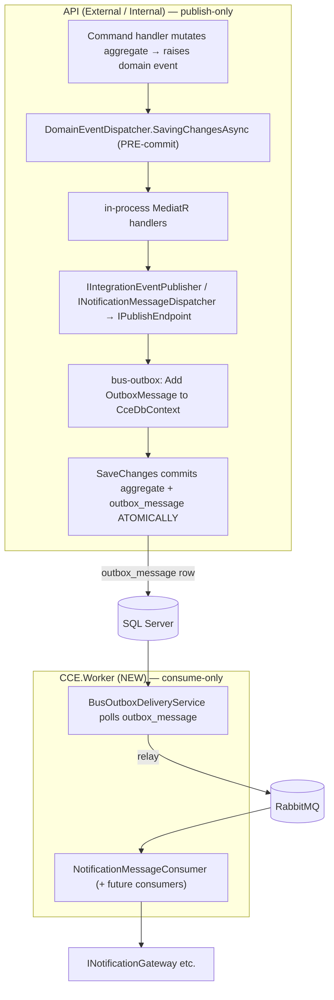

# Plan: RabbitMQ + MassTransit reliable async event handling (outbox + Worker)

## Context

Today domain events are dispatched **in-process and synchronously**.
`DomainEventDispatcher` (`backend/src/CCE.Infrastructure/Persistence/Interceptors/DomainEventDispatcher.cs`)
drains aggregate domain events in EF's **`SavedChangesAsync` (post-commit)** and pushes them straight
through MediatR's `IPublisher`. The only thing that touches a bus is `NotificationMessage`, published by
`MassTransitNotificationMessageDispatcher` → `IPublishEndpoint`, and the transport is **InMemory**
everywhere (`Messaging:Transport` defaults to `InMemory`; only `CCE.Api.Internal/appsettings.Development.json`
sets it explicitly — both APIs otherwise rely on the `MessagingOptions` default).

Problems:
- **Dual-write / lost messages.** The bus publish runs *after* the DB transaction commits and off it, so a
  crash between commit and publish silently drops the message.
- **No durability today even for notifications.** Because the publish is post-commit, there is no
  `SaveChanges` after it — if the outbox were enabled now, captured rows would never be persisted.
- **Only notifications go async**, and the consumer runs in-process in the API.

This plan: **(1)** stand up a real RabbitMQ broker and wire the RabbitMQ transport with externalised
credentials; **(2)** add the **MassTransit EF Core transactional outbox** on `CceDbContext` so a message is
staged in the *same* SQL transaction as the aggregate; **(3)** **move domain-event dispatch from post-commit
to pre-commit (`SavingChangesAsync`)** so the outbox actually captures published messages; **(4)** add a new
**`CCE.Worker`** service that hosts all consumers + the outbox delivery loop, leaving the APIs publish-only;
and **(5)** add an `IIntegrationEventPublisher` abstraction + contracts folder so future async events can be
carried over the bus without leaking MassTransit into `CCE.Application`.

Everything existing is kept: `AddCceMessaging`, `MessagingOptions`, `MassTransitNotificationMessageDispatcher`,
`NotificationMessageConsumer(+Definition)`, and InMemory as the dev/test default.

---

## Why the pre-commit move is mandatory (verified)

MassTransit's EF **bus outbox** captures a publish by adding an `OutboxMessage` row to the DbContext's
**change tracker during the `Publish()` call**; that row is only persisted when a subsequent
`SaveChanges` runs (confirmed via MassTransit docs + discussion #4325). EF runs `SavingChangesAsync`
interceptors *before* `StateManager.SaveChangesAsync` gathers entries, so rows `Add`ed inside the interceptor
are included in the same save. Therefore:

- Publishing at **post-commit** (today) → outbox row added with **no following save** → never persisted. ❌
- Publishing at **pre-commit** (`SavingChangesAsync`) → handlers publish → outbox rows added → **same save
  persists them atomically with the aggregate**. ✅

Re-entrancy is safe: the 8 domain-event handlers in `CCE.Application/Notifications/Handlers/` only **read +
dispatch** (none call `SaveChanges`), and bus-outbox `Publish` only `Add`s to the tracker (no nested save).

---

## Architecture (target)



Rule: **APIs publish only; the Worker consumes.** Both processes enable the outbox; only the Worker runs
receive endpoints. The `BusOutboxDeliveryService` runs wherever SQL is reachable (it is fine in the API too,
but the relay target — RabbitMQ — and the consumers live in the Worker).

---

## Work items

### 1. Packages — `Directory.Packages.props`
- Add `MassTransit.EntityFrameworkCore` pinned **8.3.7** (matches the existing MassTransit block, lines 113–119).
- Add `AspNetCore.HealthChecks.Rabbitmq` version **9.0.0** (aligns with the `AspNetCore.HealthChecks.*` 9.0.0 pins
  at lines 126–127).
- No new package needed for `MassTransit` / `MassTransit.RabbitMQ` — already referenced by
  `backend/src/CCE.Infrastructure/CCE.Infrastructure.csproj` (lines 44–45).
- Add a `<PackageReference Include="AspNetCore.HealthChecks.Rabbitmq" />` to
  `backend/src/CCE.Api.Common/CCE.Api.Common.csproj` (next to the SqlServer/Redis health-check refs, lines 32–33).
- Add `<PackageReference Include="MassTransit.EntityFrameworkCore" />` to `CCE.Infrastructure.csproj`.

### 2. Integration-event abstraction + contracts — `CCE.Application`
- New folder `backend/src/CCE.Application/Common/Messaging/`:
  - `IIntegrationEventPublisher.cs` — `Task PublishAsync<T>(T evt, CancellationToken ct) where T : class;`
    Plain interface, no MassTransit reference (mirrors how `INotificationMessageDispatcher` abstracts the bus).
  - `IntegrationEvents/` — POCO `record` contracts (no MassTransit attributes). Seed with **one** illustrative
    contract as scaffolding (e.g. `ResourcePublishedIntegrationEvent`). **No existing handler is force-migrated**
    — `NotificationMessage` already rides the bus via `INotificationMessageDispatcher` and gains durability for
    free once the outbox + pre-commit move land. The abstraction is in place for future cross-process events.
- **Arch-test safety:** contracts + interface are POCOs, so `CCE.Application` gains **no** MassTransit / EF
  dependency — keeps `Application_does_not_depend_on_Infrastructure` and `_EntityFrameworkCore`
  (`tests/CCE.ArchitectureTests/LayeringTests.cs`) green.

### 3. Infrastructure messaging wiring — `backend/src/CCE.Infrastructure/Notifications/Messaging/`
- New `MassTransitIntegrationEventPublisher : IIntegrationEventPublisher` wrapping `IPublishEndpoint`
  (sibling of `MassTransitNotificationMessageDispatcher`). Register in `DependencyInjection.cs`.
- Rework `MessagingServiceExtensions.AddCceMessaging`:
  - Add param `bool registerConsumers = false`. **APIs/Seeder → `false`** (publish-only);
    **Worker → `true`**.
  - Add the EF outbox inside `AddMassTransit(x => …)` **before** the transport switch:
    ```csharp
    x.AddEntityFrameworkOutbox<CceDbContext>(o =>
    {
        o.UseSqlServer();
        o.UseBusOutbox();   // capture Publish into outbox_message; relay after SaveChanges
    });
    ```
  - Only when `registerConsumers`: `x.AddConsumer<NotificationMessageConsumer,
    NotificationMessageConsumerDefinition>();` (+ future consumers). Move the existing unconditional
    `AddConsumer` call (line 39) behind this flag.
  - RabbitMQ branch: keep credentials out of the URI — read `RabbitMqUsername`/`RabbitMqPassword` from
    `MessagingOptions` and apply via `cfg.Host(host, vhost, h => { h.Username(...); h.Password(...); })`.
    Add `cfg.SetKebabCaseEndpointNameFormatter()` (set it on `x` so InMemory matches too) and a global
    `cfg.UseMessageRetry(...)` / circuit breaker. Per-consumer retry in `NotificationMessageConsumerDefinition`
    stays.
  - Keep the InMemory branch as default; keep the existing `UseAsyncDispatcher` swap of
    `INotificationMessageDispatcher` unchanged.
  - **Checkpoint:** confirm MassTransit's outbox interceptor is wired onto `CceDbContext`. `UseBusOutbox`
    captures via `Publish` → `Add`, so capture does not depend on interceptor ordering, but the post-save
    delivery trigger does need the interceptor. If `AddEntityFrameworkOutbox` does not auto-attach it, add it
    in `DependencyInjection.AddInfrastructure`'s `opts.AddInterceptors(...)` list (line 104) alongside
    `AuditingInterceptor` + `DomainEventDispatcher`. Verify by the crash-safety test (Verification §6).

### 4. Pre-commit domain-event dispatch — `DomainEventDispatcher.cs`
- Override **`SavingChangesAsync`** instead of `SavedChangesAsync`. Keep the drain-and-publish loop identical
  (collect aggregate events, clear, `await _publisher.Publish(...)`). Return
  `base.SavingChangesAsync(eventData, result, cancellationToken)`.
- Reads of the mutated aggregate inside handlers stay valid (entities already tracked).
- Update the XML doc comment that says "Outbox is sub-project 8 work" / "post-commit".

### 5. EF migration for outbox tables
- In `CceDbContext.OnModelCreating` (`backend/src/CCE.Infrastructure/Persistence/CceDbContext.cs:210`), after
  `base.OnModelCreating` + `ApplyConfigurationsFromAssembly`, add:
  ```csharp
  builder.AddInboxStateEntity();
  builder.AddOutboxStateEntity();
  builder.AddOutboxMessageEntity();
  ```
  (`using MassTransit;`). Snake_case naming convention names the columns → `inbox_state`, `outbox_state`,
  `outbox_message`.
- Generate the migration (design-time factory `CceDbContextDesignTimeFactory.cs` reads `CCE_DESIGN_SQL_CONN`):
  ```
  dotnet ef migrations add AddMassTransitOutbox \
    --project backend/src/CCE.Infrastructure --startup-project backend/src/CCE.Infrastructure
  ```
  Lands in `backend/src/CCE.Infrastructure/Persistence/Migrations/`. `CCE.Seeder` (`--migrate`) remains the
  canonical applier — no seed-order change.

### 6. New `CCE.Worker` project (hosts consumers)
- `backend/src/CCE.Worker/CCE.Worker.csproj` — references `CCE.Application`, `CCE.Domain`,
  `CCE.Infrastructure`, and **`CCE.Api.Common`** (to reuse `UseCceSerilog`, `AddCceOpenTelemetry`,
  `AddCceHealthChecks`). Use **`WebApplication`** as host so those ASP.NET-based extensions work and it can
  expose `/health`; it maps **no business endpoints** — only health + MassTransit hosted services.
- `Program.cs`: `builder.Host.UseCceSerilog();` → `AddInfrastructure(config, registerConsumers: true)` →
  `AddCceHealthChecks(config)` → `AddCceOpenTelemetry(config, "CCE.Worker")`; map `/health` + `/health/ready`
  like the APIs (`MapHealthChecks`).
- Thread the flag: add an optional `bool registerConsumers = false` param to
  `DependencyInjection.AddInfrastructure` that it forwards to `AddCceMessaging`. APIs + Seeder keep the default
  (`false`); only the Worker passes `true`.
- `appsettings.json` / `appsettings.Development.json` mirroring the APIs' `Infrastructure` + `Messaging`
  sections. Dev → `Transport: "InMemory"`; `appsettings.Production.json` → `Transport: "RabbitMQ"`.
- `Dockerfile` modeled on `backend/src/CCE.Api.External/Dockerfile`.
- Add the project to `backend/CCE.sln`.
- Note: with the Worker owning consumers, the APIs no longer run `NotificationMessageConsumer` in-process —
  they still **publish** via the outbox, which is the intended behavior.

### 7. Config + secrets
- Extend `MessagingOptions` (`backend/src/CCE.Infrastructure/Notifications/Messaging/MessagingOptions.cs`) with
  nullable `RabbitMqUsername`, `RabbitMqPassword` (required only when `Transport=RabbitMQ`).
- Add a consistent `Messaging` section to **both** APIs' base `appsettings.json` (currently only Internal Dev
  has one) and to the Worker. `appsettings.Production.json` (both APIs + Worker):
  `Transport: "RabbitMQ"`, `RabbitMqHost`, `RabbitMqVirtualHost: "/cce-prod"`. Real credentials via env vars
  (`Messaging__RabbitMqUsername`, `Messaging__RabbitMqPassword`) — never committed.
- Dev/test stay `InMemory`; integration tests keep `UseAsyncDispatcher=false` where they mock the gateway.

### 8. Local broker — repo-root `docker-compose.yml` (NOT a new backend file)
- Add a `rabbitmq` service using `rabbitmq:3-management` (ports `5672` + `15672`) on the existing `cce-net`
  network, with a named volume `rabbitmq-data`, default user/pass `cce`/`cce` via
  `RABBITMQ_DEFAULT_USER`/`RABBITMQ_DEFAULT_PASS`, and a `rabbitmq-diagnostics ping` healthcheck (match the
  style of the existing services). Devs flip `Messaging__Transport=RabbitMQ` to use it and watch the mgmt UI.
- `docker-compose.override.yml`: add a `rabbitmq:` stanza placeholder for dev tweaks (consistent with the file).
- `docker-compose.prod.yml`: add a `rabbitmq` service + a new `worker` service
  (`image: ghcr.io/.../cce-worker:${CCE_IMAGE_TAG}`, `depends_on: migrator` completed + `rabbitmq` healthy,
  same `Infrastructure__*` + `Messaging__*` env as the APIs). Mirror credentials via env_file.

### 9. Observability + health
- `OpenTelemetryExtensions.cs` (`backend/src/CCE.Api.Common/Observability/`): add `.AddSource("MassTransit")`
  to the tracing builder (line ~36, next to `.AddSource("CCE")`) so publish/consume spans flow to Seq.
- `CceHealthChecksRegistration.cs` (`backend/src/CCE.Api.Common/Health/`): bind `Messaging` config; when
  `Transport == "RabbitMQ"`, add `.AddRabbitMQ(...)` tagged `ready` using the configured host/creds.

### 10. Tests
- New test in `tests/CCE.Infrastructure.Tests` using MassTransit's in-memory test harness
  (`MassTransit.Testing`, `MassTransit.Testing.Helpers` already pinned): publishing an integration event /
  `NotificationMessage` is consumed by `NotificationMessageConsumer`.
- Re-run `tests/CCE.ArchitectureTests` to confirm `CCE.Application` still has no MassTransit/EF dependency.
- Validate the `SavingChangesAsync` relocation against `tests/CCE.Domain.Tests` + a green build (note:
  `CCE.Application.Tests` is pre-existingly broken — rely on Domain tests + build, per prior guidance).

### 11. Docs
- **Create** `docs/masstransit-messaging-guide.md` (it does not exist today): Worker topology, the outbox flow,
  why dispatch moved to `SavingChangesAsync`, the integration-event contract pattern, and the
  "consumers run only in the Worker" rule. Optionally link from `docs/roadmap.md`.

### 12. Dev fallback — InMemory when RabbitMQ is absent (dev-only)
**Why:** the current dev/server environment has no RabbitMQ, so `Transport=RabbitMQ` there must not break
startup. MassTransit picks its transport once at bus-build time (no runtime failover). With the outbox in
place a *transient* prod outage needs no fallback — the host starts, MassTransit auto-reconnects, and rows sit
durably in `outbox_message`. So this is purely a **dev convenience for a totally-absent broker**, not prod
resilience.

- Add `MessagingOptions.FallbackToInMemoryIfUnavailable` (default **`false`**); set **`true`** only in
  `appsettings.Development.json` (APIs + Worker).
- In `AddCceMessaging`, when `Transport=RabbitMQ` **and** the flag is `true`, run a **fast (~2s) TCP/AMQP probe**
  to the host before building the bus. On failure: `LogWarning` and take the **InMemory** branch instead.
- **Consumer placement under fallback:** an InMemory bus is per-process, so force `registerConsumers = true`
  in the falling-back host (restores single-process dev behavior). Applies only to the InMemory fallback path.
- Keep the bus outbox enabled on the InMemory path too (identical code path:
  `outbox_message` → in-memory bus → in-process consumer).
- **Production stays `false`** — a broker problem is never masked; durability comes from the outbox +
  auto-reconnect, and `/health/ready` surfaces a real outage.

| Env | `Transport` | Fallback | Effective behavior |
|---|---|---|---|
| Dev (no broker) | RabbitMQ/InMemory | `true` | Probe fails → InMemory + in-process consumers. One process, no broker. |
| Dev (broker via compose) | RabbitMQ | `true` | Probe succeeds → RabbitMQ + Worker consumers. |
| Production | RabbitMQ | `false` | Always RabbitMQ; outbox retains messages through outages; health reports broker. |

---

## Files touched (representative)

| Area | Path |
|---|---|
| Packages | `Directory.Packages.props`, `backend/src/CCE.Infrastructure/CCE.Infrastructure.csproj`, `backend/src/CCE.Api.Common/CCE.Api.Common.csproj` |
| Contracts/abstraction | `backend/src/CCE.Application/Common/Messaging/IIntegrationEventPublisher.cs`, `.../IntegrationEvents/*.cs` |
| Bus wiring | `backend/src/CCE.Infrastructure/Notifications/Messaging/MessagingServiceExtensions.cs`, `MessagingOptions.cs`, new `MassTransitIntegrationEventPublisher.cs` |
| DI | `backend/src/CCE.Infrastructure/DependencyInjection.cs` (`AddInfrastructure(config, registerConsumers)`) |
| Transactional dispatch | `backend/src/CCE.Infrastructure/Persistence/Interceptors/DomainEventDispatcher.cs` |
| DbContext + migration | `backend/src/CCE.Infrastructure/Persistence/CceDbContext.cs` + new `Migrations/*_AddMassTransitOutbox.cs` |
| New service | `backend/src/CCE.Worker/**`, `backend/CCE.sln` |
| Observability/health | `backend/src/CCE.Api.Common/Observability/OpenTelemetryExtensions.cs`, `backend/src/CCE.Api.Common/Health/CceHealthChecksRegistration.cs` |
| Config | `appsettings*.json` for both APIs + Worker; repo-root `docker-compose.yml`, `docker-compose.override.yml`, `docker-compose.prod.yml` |
| Docs | new `docs/masstransit-messaging-guide.md` |

---

## Verification (end-to-end)

1. **Build (gate):** `dotnet build backend/CCE.sln` — must pass (warnings-as-errors).
2. **Migration:** set `CCE_DESIGN_SQL_CONN`, run `dotnet ef database update --project backend/src/CCE.Infrastructure
   --startup-project backend/src/CCE.Infrastructure`; confirm `outbox_message`, `outbox_state`, `inbox_state` exist.
3. **Broker up:** `docker compose up -d rabbitmq`; open the mgmt UI at `http://localhost:15672` (cce/cce).
4. **Run with RabbitMQ:** set `Messaging__Transport=RabbitMQ` (+ host/creds), launch an API and
   `dotnet run --project backend/src/CCE.Worker`.
5. **Trigger an event:** perform an action whose domain-event handler dispatches a notification (e.g. publish a
   resource via the Internal API). Observe: an `outbox_message` row appears then drains; a message flows through
   the RabbitMQ queue (mgmt UI); the Worker logs `Consuming NotificationMessage …` and the gateway is invoked.
6. **Crash-safety spot check (validates the outbox capture):** stop RabbitMQ, trigger the action — the API still
   returns 200 and the `outbox_message` row **persists**; restart RabbitMQ and confirm the delivery service relays
   it. (If the row never appears, the pre-commit capture / interceptor wiring in §3 is wrong.)
7. **Tests:** `dotnet test backend/tests/CCE.Domain.Tests`, the new harness test, and
   `backend/tests/CCE.ArchitectureTests`.

## Out of scope / follow-ups
- Consumer-side **inbox** (idempotent consume) — tables added now; enable `UseInbox` per-consumer later.
- Migrating specific in-process handlers to real cross-process integration events as needs arise.
