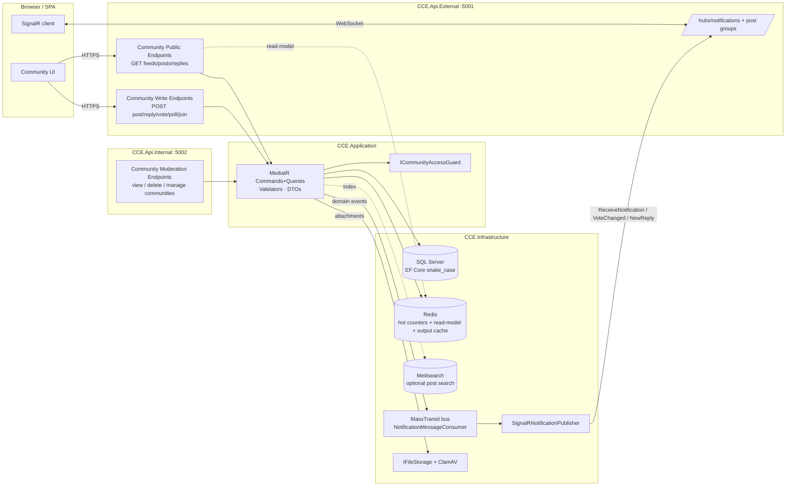
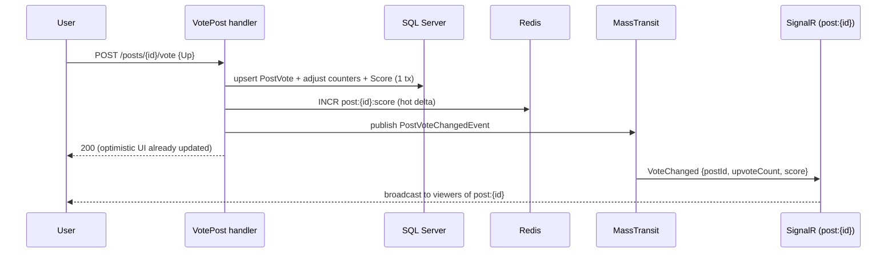

# Sprint 09 — Knowledge Community (Reddit-style) — Implementation Plan

**Stories:** US021 view community · US022 view topic groups · US023 follow topic · US024 view post · US025 share post · US026 create post · US027 interact (up/down) · US028 follow post · US029 reply · US030 view user profile · US031 follow user · US054–US057 admin view/delete.
**Extended product asks (from the PO brief, beyond the BRD):** multiple **communities** that are public or private (members-only) with **follow / request-to-join**; posts pick a **community id** and carry **topic ids + tags**; post body is **free text, media (≤10), file (≤2 MB: xlsx/pdf/doc), or a poll** (options + deadline + result); **Reddit-style up/down** on **posts and comments**; everything **real-time and fast**.
**Branch:** `feat/sprint-09-community`
**Architecture:** Clean Architecture + DDD + CQRS (MediatR) across `CCE.Api.External` (public) and `CCE.Api.Internal` (admin/CMS), per `CLAUDE.md`.

---

## 0. Existing code is reference-only — it will be **refactored**, not preserved

> **Directive:** the current Community code does **not** constrain this design. It was an earlier, thinner interpretation; under the new business model the types below are **rewritten** to the target design in §2+ (and to the code conventions in §A). Use this table only to know *what already has a name in the tree* and *how far it is from target* — not as a foundation to keep intact. Anything that conflicts with the target model (e.g. star ratings, title-less posts, single grouping) is replaced.

A Community vertical was shipped in an earlier phase. Verified in the tree today (each row is refactored to spec):

| Concern | Location | Status |
|---|---|---|
| `Topic` aggregate (bilingual, slug, parent, icon, `OrderIndex`, `IsActive`) | `src/CCE.Domain/Community/Topic.cs` | ✅ keep — becomes "topic group / category" (§5) |
| `Post` aggregate (single-locale, `Content` ≤8000, `TopicId`, `AuthorId`, `IsAnswerable`, `AnsweredReplyId`) | `src/CCE.Domain/Community/Post.cs` | ⚠️ **extend** — no title/type/community/attachments/poll/tags |
| `PostReply` (`SoftDeletableEntity`, threading via `ParentReplyId`, `IsByExpert`) | `src/CCE.Domain/Community/PostReply.cs` | ⚠️ extend — add votes, `ThreadPath`/`Depth`/`ChildCount` nesting, mentions (§9b) |
| `PostRating` (**1–5 stars**, unique `(PostId,UserId)`) | `src/CCE.Domain/Community/PostRating.cs` | ❌ **supersede** with up/down vote (§6) |
| `TopicFollow`, `PostFollow`, `UserFollow` (+ EF configs) | `src/CCE.Domain/Community/*Follow.cs` | ✅ reuse; add `CommunityFollow` |
| `PostCreatedEvent` | `src/CCE.Domain/Community/Events/PostCreatedEvent.cs` | ✅ reuse |
| Write svc / read svc / moderation svc | `src/CCE.Infrastructure/Community/{CommunityWriteService,CommunityReadService,CommunityModerationService}.cs` | ✅ extend |
| Commands: CreatePost, CreateReply, EditReply, RatePost, MarkPostAnswered, SoftDeletePost/Reply, Follow/Unfollow (topic/post/user), Topic CRUD | `src/CCE.Application/Community/Commands/**` | ✅ extend / add |
| Public queries: GetPublicPostById, ListPublicPostsInTopic, ListPublicPostReplies, GetPublicTopicBySlug, ListPublicTopics, ListFeaturedPosts, GetMyFollows | `src/CCE.Application/Community/Public/Queries/**` | ⚠️ extend DTOs (votes, attachments, poll, community) |
| Admin query: ListAdminPosts | `src/CCE.Application/Community/Queries/ListAdminPosts/**` | ✅ extend |
| Endpoints: `MapCommunityPublicEndpoints`, `MapCommunityWriteEndpoints` (External), `MapCommunityModerationEndpoints` (Internal) | `src/CCE.Api.*/Endpoints/Community*.cs` | ⚠️ extend |
| Permissions `Community.Post.{Create,Reply,Rate,Moderate,Follow}` | `permissions.yaml` lines 118–134 | ⚠️ add `Vote`, `Community.{Create,Update,Delete,Join,Moderate}`, `Poll.{Create,Vote}` |
| `NotificationEventType.CommunityPostCreated = 7` | `src/CCE.Domain/Notifications/NotificationEventType.cs` | ✅ add new members (§13) |
| SignalR `NotificationsHub` (group `user:{id}`) + `ISignalRNotificationPublisher` | `src/CCE.Infrastructure/Notifications/*` | ✅ reuse + add `post:{id}` groups (§11) |
| `AssetFile` + `UploadAsset` pipeline (storage → ClamAV → persist) | `src/CCE.Domain/Content/AssetFile.cs`, `src/CCE.Application/Content/Commands/UploadAsset/**` | ✅ reuse for attachments (§8) |
| `Tag` + `news_tag` join (many-to-many) | `src/CCE.Domain/Content/Tag.cs`, `NewsConfiguration` | ✅ reuse; add `post_tag` (§9) |
| Pagination (`ToPagedResultAsync` + projection overload), `Response<T>`, `MessageFactory` | `src/CCE.Application/Common/**` | ✅ reuse |

**Net:** reusable *plumbing* exists (SignalR, asset pipeline, tags, pagination, `Response<T>`/`MessageFactory`) and is kept. The Community *domain and its handlers/endpoints are rewritten* to the target model — seven build areas:

1. **Community container** (public/private, membership, join-requests, follow).
2. **Post model**: `Title`, `PostType` (Info/Question/Poll), `CommunityId`, attachments, tags.
3. **Up/down voting** on posts (replaces stars) **and** on replies.
4. **Polls**: options + deadline + results.
5. **Attachments**: media (≤10) and documents (≤2 MB, xlsx/pdf/doc) over the asset pipeline.
6. **Real-time** vote/reply/notification push via SignalR `post:{id}` groups + Redis hot counters.
7. **Performance**: denormalized vote counters, "hot" ranking, output-cache + Redis read-model strategy (§11).

---

## A. Code architecture & conventions (mandatory — applies to every type in this plan)

This plan is written to the following rules; all command/query/endpoint descriptions below assume them.

### A.1 CQRS read/write split
- **Read side = context-optimized.** Query handlers depend on **`ICceDbContext` directly** and project straight to DTOs: `AsNoTracking()`, `.Select(...)` into the DTO (projection overload of `ToPagedResultAsync`), filters/sorts/access-gating pushed into SQL. **No repositories on the read path** — repositories materialize aggregates and would over-fetch. One query → one tuned SQL shape.
- **Write side = repositories + context-as-unit-of-work.** Command handlers depend on the **aggregate repository** (`ICommunityRepository`, `IPostRepository`, `IPollRepository`, …) to *fetch* the aggregate (with the includes that command needs) and to `AddAsync` new ones; they mutate the domain object; then **`ICceDbContext.SaveChangesAsync` is the single unit-of-work commit** (it runs the auditing + domain-event-dispatch interceptors). Handlers never call EF save on a repository — the repo stages, the context commits.

### A.2 Result contract
- **Every handler (commands *and* queries) returns `Response<T>`** (or `Response<VoidData>` for void), built via the **injected `MessageFactory`** — never `new Response(...)` and never a bare DTO/`Guid`. Use the factory helpers: `_msg.Ok(dto, "POST_CREATED")`, `_msg.Ok("CON013_REPLY_SENT")`, `_msg.NotFound<T>("POST_NOT_FOUND")`, `_msg.BusinessRule<T>("POLL_CLOSED")`, `_msg.AssetNotClean<T>()`, `_msg.ValidationError<T>(...)`. New domain keys are added to `ApplicationErrors`/the message catalog, mapped to the BRD AR codes (ERR0xx/CON0xx/NTF0xx).
- Endpoints translate `Response<T>` to HTTP with the existing `.ToHttpResult()` extension; status comes from `Response.MessageType`, not from logic in the endpoint.

### A.3 No inline classes
- Commands, queries, request DTOs, response DTOs, and validators each live in **their own file** under the feature folder (`CCE.Application/Community/Commands/<Name>/`, `…/Public/Queries/<Name>/`, `…/Dtos/`). **No `sealed record` declared inside an endpoint file** (today's `Community*Endpoints.cs` declare request records at the bottom — that is removed). Endpoint request bodies bind to a DTO record imported from the Application layer.

### A.4 Logic-free endpoints ("no code in controllers")
- Minimal-API endpoints contain **only**: route + auth attribute, model-bind the request DTO, build the command/query, `await mediator.Send(...)`, `return result.ToHttpResult()`. **No** `Guid.Empty` checks, no `userId` plumbing, no mapping, no branching. The current pattern of reading `ICurrentUserAccessor` and short-circuiting `Results.Unauthorized()` in the endpoint is moved **into the handler** (handler resolves the caller via injected `ICurrentUserAccessor` and returns `_msg.NotAuthenticated<T>()`); endpoints just declare `.RequireAuthorization(Permissions.X)`.

```csharp
// Endpoint — the ONLY shape allowed
community.MapPost("/posts/{id:guid}/vote", async (
        Guid id, VotePostRequest body, IMediator mediator, CancellationToken ct) =>
    {
        var result = await mediator.Send(new VotePostCommand(id, body.Direction), ct);
        return result.ToHttpResult();
    })
    .RequireAuthorization(Permissions.Community_Post_Vote)
    .WithName("VotePost");
// VotePostRequest, VotePostCommand, its handler, validator, DTO → each in its own file.
```

---

## 1. Domain decisions (read this first)

| # | Decision | Rationale |
|---|---|---|
| D1 | **Add a `Community` aggregate** distinct from `Topic`. Community = the subreddit-like container (privacy, membership, posts). `Topic` = a cross-cutting *category/topic group* a post is filed under. `Tag` = free labels. A post therefore has **`CommunityId` (required) + `TopicId` (required) + Tags (0..n)**. | The brief explicitly separates "user picks the community id" from "all have topic ids and tags". Reuses the existing `Topic`/`Tag` machinery instead of overloading it. |
| D2 | **Replace `PostRating` (1–5 stars) with `PostVote` (+1/−1).** Per §0 the old code is refactored away: `PostRating`, `RatePost`, `Community.Post.Rate` are removed and `post_ratings` dropped (§15) in favour of `VotePost`/`Community.Post.Vote`. | US027 is authoritative: "upvote or downvote… only upvotes displayed publicly… downvotes affect ranking only." Stars contradict the BRD and the Reddit-style brief. |
| D3 | **Denormalize counters** onto `Post`/`PostReply` (`UpvoteCount`, `DownvoteCount`, `Score`, `ReplyCount`) and treat the per-user vote rows as the source of truth. | Read pages never aggregate the vote table; ranking sorts on an indexed `Score` column. |
| D4 | **Posts are immutable in *kind*.** `PostType` (Info / Question / Poll) is set at creation and never changes. A Poll post owns exactly one `Poll`; Info/Question own zero. | Keeps invariants simple; matches US026 "Post Type" dropdown. |
| D5 | **Attachments are a relational child table** (`PostAttachment` → `AssetFile`), not a JSON blob — see §3 for the relational-vs-JSON rules. | We must join virus-scan status and enforce the ≤10 / size / mime rules with referential integrity. |
| D6 | **Visibility gating happens in the query layer**, mirroring `ICountryScopeAccessor`: a new `ICommunityAccessGuard` decides whether the caller may read/post in a community (public → anyone; private → member only). | Centralizes the public/private rule; keeps handlers thin and testable. |
| D7 | **Replies (comments) are a tree with a materialized `ThreadPath`** (+ `Depth`, `ChildCount`), capped at `MaxDepth=8`; deeper replies attach to the deepest allowed ancestor. | One indexed `LIKE 'path%'` read per subtree instead of recursive round-trips; bounded nesting keeps payloads and UI sane. See §9b. |
| D8 | **Mentions use an explicit `MentionedUserIds[]` contract** (client sends the ids it rendered as `@handle`), validated + access-gated + deduped server-side, stored relationally, notified per surviving mention. | Avoids fragile server-side @-text parsing, prevents private-thread leakage, makes "my mentions" a cheap indexed query. See §9b. |
| D9 | **Posts have a `Draft → Published` lifecycle** (`Status` + `PublishedOn`), mirroring `Resource.Draft()/Publish()`. Drafts are author-private, excluded from feeds/cache/search, validated leniently; `PostCreatedEvent` + mention notifications fire **only at publish**. | US026 authors need to compose/poll-build over time; matches the platform's existing content-lifecycle pattern. See §7.1. |

---

## 2. Target architecture (component view)



**Flow in one line:** writes go through MediatR → domain aggregate → EF (+ Redis counter bump) → domain event → MassTransit → SignalR push to `post:{id}` / `user:{id}`; reads are output-cached (anonymous) or served from a Redis read-model, falling back to projected EF queries.

---

## 3. Relational vs JSON — the data-shape policy

**Rule of thumb used throughout:** *relational* when we filter, join, aggregate, sort, or need FK integrity; *JSON column* when the value is an opaque blob always read whole with its parent and never queried into.

| Data | Shape | Why |
|---|---|---|
| Community, CommunityMembership, JoinRequest | **Relational** | Filtered (my communities), aggregated (member counts), FK-integral, access-gated. |
| Post, PostReply | **Relational** | Paged, sorted, filtered by community/topic/author, soft-deletable. |
| Post `Status` / `PublishedOn` (draft lifecycle) | **Relational columns** | Feeds filter `status=Published`; "my drafts" filters `(author_id, status)`; both indexed. |
| **Votes** (`PostVote`, `ReplyVote`) | **Relational** | Unique `(targetId,userId)`, flipped/removed individually; counters derived. |
| Denormalized counters (`UpvoteCount`, `Score`, `ReplyCount`) | **Relational columns** | Sorted/ranked in SQL `ORDER BY score`; can't index a JSON field cheaply on SQL Server. |
| Poll, PollOption, PollVote | **Relational** | Per-option tallies are aggregations; one-vote-per-user uniqueness; deadline filter. |
| post_tag (M:N), topic FK | **Relational** | Filter "posts with tag X / in topic Y"; reuse existing `Tag`. |
| **Mention** (post/reply → user) | **Relational** | Queried ("my mentions"), deduped, FK to user, drives notifications. |
| Reply `ThreadPath` / `Depth` / `ChildCount` | **Relational columns** | `ThreadPath` indexed for subtree reads; depth/counts sorted & displayed. |
| PostAttachment → AssetFile | **Relational** | Must join `VirusScanStatus`, enforce ≤10 + size + mime, FK to asset. |
| **Attachment display metadata** (caption, sort order, alt text) | **JSON** (`PostAttachment.MetadataJson`) | Never queried; rendered as-is with the attachment. |
| **Poll settings** (`AllowMultiple`, `IsAnonymous`, `ShowResultsBeforeClose`) | **JSON** (`Poll.SettingsJson`) | Opaque flags read whole; no querying into them. |
| **Community theming** (banner/accent colors, rule list, sidebar markdown) | **JSON** (`Community.PresentationJson`) | Pure presentation; never filtered. |
| Notification rendered payload | **JSON** (already) | Existing `UserNotification.RenderedBody`. |
| Redis read-model / feed cache | **JSON-serialized DTOs** | Cache representation only; SQL remains source of truth. |

> Net: the **system of record is relational**; JSON is confined to opaque presentation/settings blobs and to the Redis cache layer. This keeps every "find / rank / count" path on indexed columns.

---

## 4. Entity-relationship model (ERD)

```mermaid
erDiagram
  COMMUNITY ||--o{ COMMUNITY_MEMBERSHIP : has
  COMMUNITY ||--o{ COMMUNITY_JOIN_REQUEST : receives
  COMMUNITY ||--o{ COMMUNITY_FOLLOW : followed_by
  COMMUNITY ||--o{ POST : contains
  TOPIC ||--o{ POST : categorizes
  POST }o--o{ TAG : "post_tag"
  POST ||--o{ POST_ATTACHMENT : has
  POST_ATTACHMENT }o--|| ASSET_FILE : points_to
  POST ||--o| POLL : "Poll type only"
  POLL ||--o{ POLL_OPTION : offers
  POLL_OPTION ||--o{ POLL_VOTE : tallies
  POST ||--o{ POST_VOTE : voted
  POST ||--o{ POST_REPLY : answered_by
  POST_REPLY ||--o{ REPLY_VOTE : voted
  POST_REPLY ||--o{ POST_REPLY : threads
  POST ||--o{ MENTION : "in body"
  POST_REPLY ||--o{ MENTION : "in body"
  POST ||--o{ POST_FOLLOW : followed
  TOPIC ||--o{ TOPIC_FOLLOW : followed

  COMMUNITY {
    guid Id PK
    string NameAr
    string NameEn
    string Slug UK
    int Visibility "0 Public 1 Private"
    int MemberCount "denormalized"
    json PresentationJson
    bool IsActive
  }
  COMMUNITY_MEMBERSHIP {
    guid Id PK
    guid CommunityId FK
    guid UserId FK
    int Role "0 Member 1 Moderator"
    datetime JoinedOn
  }
  COMMUNITY_JOIN_REQUEST {
    guid Id PK
    guid CommunityId FK
    guid UserId FK
    int Status "0 Pending 1 Approved 2 Rejected"
  }
  POST {
    guid Id PK
    guid CommunityId FK
    guid TopicId FK
    guid AuthorId
    int PostType "0 Info 1 Question 2 Poll"
    int Status "0 Draft 1 Published"
    datetime PublishedOn "nullable"
    string Title "<=150"
    string Content "<=5000"
    int UpvoteCount
    int DownvoteCount
    int Score "indexed for hot rank"
    int ReplyCount
    bool IsAnswerable
    guid AnsweredReplyId "nullable"
  }
  POST_VOTE {
    guid Id PK
    guid PostId FK
    guid UserId
    int Value "+1 / -1"
  }
  POLL {
    guid Id PK
    guid PostId FK
    datetime Deadline
    json SettingsJson
  }
  POLL_OPTION {
    guid Id PK
    guid PollId FK
    string Label
    int VoteCount "denormalized"
  }
  POST_ATTACHMENT {
    guid Id PK
    guid PostId FK
    guid AssetFileId FK
    int Kind "0 Media 1 Document"
    int SortOrder
    json MetadataJson
  }
  POST_REPLY {
    guid Id PK
    guid PostId FK
    guid AuthorId
    guid ParentReplyId "nullable"
    string ThreadPath "indexed /root/child/.."
    int Depth "<=8"
    int ChildCount "denormalized"
    int UpvoteCount
    int DownvoteCount
    int Score
    bool IsByExpert
    bool IsDeleted "soft-delete"
  }
  MENTION {
    guid Id PK
    int SourceType "0 Post 1 Reply"
    guid SourceId "polymorphic"
    guid MentionedUserId FK
    guid MentionedByUserId
    datetime CreatedOn
  }
```


> `MENTION` is polymorphic (`SourceType` + `SourceId`) — the dashed lines from `POST`/`POST_REPLY` are logical, not physical FKs.

---

## 5. Communities, membership & join-requests (NEW — backs the PO brief)

### 5.1 Domain — `src/CCE.Domain/Community/`
- **`Community : AggregateRoot<Guid>`** `[Audited]` — `NameAr/En`, `DescriptionAr/En`, `Slug` (reuse the kebab `SlugPattern` from `Topic`), `Visibility` enum `{ Public=0, Private=1 }`, `MemberCount` (denormalized), `PresentationJson`, `IsActive`. Factory `Create(...)`; `Rename`, `ChangeVisibility`, `Deactivate/Activate`, `IncrementMembers/DecrementMembers`.
- **`CommunityMembership : Entity<Guid>`** — `CommunityId`, `UserId`, `Role` `{ Member=0, Moderator=1 }`, `JoinedOn`. Factory `Join(...)`. Unique `(CommunityId, UserId)`.
- **`CommunityJoinRequest : Entity<Guid>`** — `CommunityId`, `UserId`, `Status` `{ Pending, Approved, Rejected }`, `RequestedOn`, `DecidedById/On`. `Submit`, `Approve` (→ raises `JoinRequestApprovedEvent`, caller creates membership + `IncrementMembers`), `Reject`. Unique partial index on `(CommunityId, UserId)` where `Status = Pending`.
- **`CommunityFollow : Entity<Guid>`** — mirror `TopicFollow`; unique `(CommunityId, UserId)`. Following ≠ membership: anyone can *follow* a public community for feed/notifications; *membership* (and thus posting/reading a private one) requires `Join` (public) or an approved `JoinRequest` (private).

### 5.2 Access rule — `ICommunityAccessGuard` (Application)
```
CanRead(communityId, userId?)  => community.Public OR caller is member/mod/admin
CanPost(communityId, userId)   => caller is member/mod (any community) ; admins bypass
CanModerate(communityId,userId)=> caller is moderator of it OR holds Community.Moderate
```
Implemented in Infrastructure against EF (`HttpContextCommunityAccessGuard`); admin/super-admin bypass like the country-scope accessor. Private-community reads that fail the guard return not-found (don't leak existence) → maps to `ERR001/NTF001`.

### 5.3 Endpoints (External write group `/api/community`)
- `POST /communities/{id}/follow` · `DELETE /communities/{id}/follow`
- `POST /communities/{id}/join` — public → instant membership (`CON…`); private → creates a `JoinRequest` (pending) and notifies moderators.
- `POST /communities/{id}/leave`
- Moderator/admin (Internal): `POST /communities`, `PUT /communities/{id}`, `POST /communities/{id}/visibility`, join-request queue `GET /communities/{id}/join-requests`, `POST /join-requests/{id}/approve|reject`.

---

## 6. Up/down voting — posts **and** comments (US027 + brief)

### 6.1 Domain
- **`PostVote : Entity<Guid>`** — `PostId`, `UserId`, `Value` (+1/−1), `VotedOn`. Unique `(PostId, UserId)`. Methods: `Up()/Down()` flip `Value`.
- **`ReplyVote : Entity<Guid>`** — same shape, `ReplyId`. Unique `(ReplyId, UserId)`.
- On `Post`/`PostReply` add denormalized `UpvoteCount`, `DownvoteCount`, `Score` + domain methods `ApplyVote(oldValue, newValue)` that adjust counters and recompute `Score`.
- **Ranking / `Score`:** store a hot-rank double computed at write time:
  `Score = log10(max(|U−D|,1)) * sign(U−D) + (CreatedOnEpoch / 45000)` (Reddit "hot"). Sorted via an index on `Score DESC`. US027: **only `UpvoteCount` is exposed publicly**; `DownvoteCount` is internal (feeds `Score` only) — the public DTO never carries it.

### 6.2 Vote command (replaces `RatePost`)
- `VotePostCommand(PostId, Direction)` / `VoteReplyCommand(ReplyId, Direction)` where `Direction ∈ {Up, Down, None}` (None = retract). Each command, its handler, validator and the `VotePostRequest` DTO live in their own files (§A.3).
- Handler (write side, §A.1): resolve caller via `ICurrentUserAccessor`; **fetch the `Post` aggregate through `IPostRepository`**; load/create the `PostVote` row; mutate counters + `Score` on the aggregate; **commit once via `ICceDbContext.SaveChangesAsync`** (UoW). Then bump the Redis hot counter (§11) and raise `PostVoteChangedEvent` (dispatched by the SaveChanges interceptor) for SignalR. Returns `_msg.Ok("POST_VOTED")`; failure → `_msg.BusinessRule<…>` mapped to `ERR001`. Idempotent + concurrency-safe (`RowVersion`).
- **Remove** `RatePostCommand`/`RatePostRequest`/`/posts/{id}/rate`/`Community.Post.Rate` and `PostRating` as part of the refactor (no back-compat kept — per §0 the old code is replaced; the `post_ratings` table is dropped in the migration or left orphaned, see §15).

---

## 7. Post creation, types & **draft lifecycle** (US026, extended)

`CreatePostCommand` grows to (the `SaveAsDraft` flag drives the lifecycle — see §7.1):
```
CreatePostCommand(
  Guid CommunityId, Guid TopicId, PostType Type,
  string Title, string? Content, string Locale,
  IReadOnlyList<Guid> TagIds,
  IReadOnlyList<PostAttachmentInput>? Attachments,   // ≤10, see §8
  PollInput? Poll,                                    // required iff Type==Poll
  IReadOnlyList<Guid> MentionedUserIds,               // §9b — notified on publish only
  bool IsAnswerable,
  bool SaveAsDraft)
```
**Publish-time** validation (FluentValidation → `ERR013` on missing required, `ERR014` on publish failure):
- `Title` required ≤150; `Content` ≤5000 (required for Info/Question; optional for Poll/media-only).
- `CommunityId` exists & `CanPost` passes; `TopicId` exists; every `TagId` exists.
- `Type==Poll` ⇒ `Poll` present with 2–10 options and a future `Deadline`; else `Poll` must be null.
- Attachments: total ≤10; media vs document rules per §8.
- `Question` ⇒ `IsAnswerable=true`.

### 7.1 Draft → Published lifecycle (D9)
Mirrors the existing `Resource.Draft()`/`Publish()` pattern.

- **`Post.Status`** enum `{ Draft = 0, Published = 1 }`; add nullable `PublishedOn`.
- **`Post.CreateDraft(...)`** — creates in `Draft`, applies only **lenient** invariants (length caps, locale, `CommunityId`/`TopicId` shape); does **not** require a non-empty title/content/poll and **does not raise `PostCreatedEvent`**.
- **`Post.Publish(clock)`** — `Draft → Published`, sets `PublishedOn`, enforces the **full per-type invariant set** above, and **raises `PostCreatedEvent`** (the single trigger for topic/community-follower notifications, §14). Idempotent: re-publishing a `Published` post is a no-op (no duplicate event).
- **Visibility:** drafts are **author-private** — excluded from every public feed/topic/community/search query (all reads add `status = Published`), never output-cached or pushed over SignalR (§11), and `ICommunityAccessGuard` reads return them only to their author.
- **Mentions on draft:** `MentionedUserIds` are *stored/validated* when saving a draft but **notified only at publish** (the publish path runs the mention diff, §9b.2) — saving a draft never pings anyone.

### 7.2 Commands & endpoints (own files, §A.3; write = repo + UoW, §A.1)
- `CreatePostCommand(..., SaveAsDraft)` — handler builds via `Post.CreateDraft(...)`; if `SaveAsDraft == false` it immediately calls `Post.Publish(clock)` in the same UoW (one-shot create-and-publish). Returns `_msg.Ok(dto, SaveAsDraft ? "POST_DRAFT_SAVED" : "CON011_POST_CREATED")`.
- `UpdateDraftCommand(PostId, …same fields)` — edits a post **while `Draft`**; fetches via `IPostRepository`, applies lenient validation, commits. Rejected if already `Published` → `_msg.BusinessRule<…>("POST_ALREADY_PUBLISHED")`.
- `PublishPostCommand(PostId)` — fetches the draft, calls `Post.Publish(clock)` (strict validation), commits (the SaveChanges interceptor dispatches `PostCreatedEvent` → follower/mention notifications). Author-only; `ERR014` on failure.
- `DeleteDraftCommand(PostId)` — hard-deletes an *unpublished* draft (published posts use the soft-delete/moderation path instead).
- Reuses permission `Community.Post.Create` (drafting is authoring — **no new permission**).

---

## 8. Attachments — media (≤10) & documents (≤2 MB) (brief)

Reuse the existing `UploadAsset` pipeline (storage → ClamAV → `AssetFile`), then link assets to the post.

- **`PostAttachment : Entity<Guid>`** — `PostId`, `AssetFileId` (FK), `Kind` `{ Media=0, Document=1 }`, `SortOrder`, `MetadataJson` (caption/alt/order). Config: index `(PostId, SortOrder)`; FK `Restrict` to `AssetFile`.
- **Upload flow:** client uploads each file via the existing asset endpoint → gets `assetFileId`s → passes them in `CreatePostCommand.Attachments`. The handler validates each asset: `VirusScanStatus == Clean`, mime/size per the matrix below, and total count ≤10.

| Kind | Allowed mime | Max size | Count |
|---|---|---|---|
| Media | `image/png`, `image/jpeg`, `image/webp`, `image/gif`, `video/mp4` | platform default | combined ≤10 |
| Document | `application/pdf`, `application/vnd.openxmlformats-officedocument.spreadsheetml.sheet` (xlsx), `application/msword` + `…wordprocessingml.document` (doc/docx) | **≤2 MB** | combined ≤10 |

- Add `Community:Attachments` config (`AllowedMediaMimeTypes`, `AllowedDocumentMimeTypes`, `MaxDocumentSizeBytes=2_097_152`, `MaxAttachmentsPerPost=10`) bound in `CCE.Api.Common`; enforced at the command boundary (the `AssetFile` domain stays generic). Flag: the current `UploadAssetCommandHandler` treats `ScanFailed` as Clean in dev — keep, but in prod the `Clean`-only gate at attach time still protects posts.

---

## 9. Topics & tags on posts (US022, brief)

- **Topic**: already a required FK (`Post.TopicId`). US022/US055 "view posts in a topic" already exists (`ListPublicPostsInTopic`) — extend its DTO with the new fields.
- **Tags**: add `post_tag` M:N exactly like `news_tag` (`builder.HasMany(p => p.Tags).WithMany().UsingEntity(j => j.ToTable("post_tag"))`). `Post.SetTags(IEnumerable<Tag>)` mirrors `News`. Public/admin list queries gain a `tagId`/`topicId` filter (indexed).

---

## 9b. Comments — nested replies & @mentions (US029, extended)

Replies (comments) form a **tree per post** and may **@mention** users. Both feed the up/down vote model (§6) and the real-time/notification paths (§11/§14). Built to the §A conventions (own-file command/query/DTO, write=repo+UoW, read=context, `Response<T>`).

### 9b.1 Nested replies (comment → reply → reply…)
- **`PostReply`** keeps `ParentReplyId` (null = top-level comment) and gains denormalized `ChildCount`, `Depth`, and a **materialized `ThreadPath`** (e.g. `/{rootId}/{childId}/…`). A whole subtree then loads with one indexed `WHERE thread_path LIKE @prefix + '%'` read — no recursive CTE round-trips.
- **Invariants** in `PostReply.Create`: a parent (when supplied) must belong to the **same post**; `Depth = parent.Depth + 1`; reject beyond `MaxDepth` (config, default **8**) — deeper attempts re-parent to the deepest allowed ancestor (Reddit-style). `parent.IncrementChildCount()`.
- **Voting:** `ReplyVote` (§6) applies to every node; siblings order by `Score` then `CreatedOn`. Only `UpvoteCount` is public (US027 parity for comments).
- **Soft-delete:** a deleted comment with children renders as a "[deleted]" tombstone so the thread stays intact (children keep their `ThreadPath`).
- **Read (context-optimized):** `ListPublicPostRepliesQuery` returns the top-level page with each node's `ChildCount`; `GetReplyThreadQuery(replyId)` loads a subtree via `ThreadPath`. Both `AsNoTracking` + projection → `Response<PagedResult<PublicPostReplyDto>>`.
- **Write (repo + UoW):** `CreateReplyCommand(PostId, ParentReplyId?, Content, Locale, MentionedUserIds[])` — handler resolves the caller, fetches `Post` (and parent reply) via `IPostRepository`/`IPostReplyRepository`, builds the reply, commits via `ICceDbContext`, raises `ReplyCreatedEvent` (drives post-follower + parent-author notifications, §14). Returns `_msg.Ok(dto, "CON013_REPLY_SENT")`; empty body → `_msg.BusinessRule<…>("REPLY_EMPTY")` → ERR016; failure → ERR017.

### 9b.2 @Mentions (in posts and comments)
- **Contract (D8):** the client sends `MentionedUserIds[]` next to the `@handle` tokens it rendered in `Content`. The handler **validates** each id exists, **dedups**, **drops self-mentions**, and **drops users who cannot see the community** (private gate, §5.2) — a mention can never leak a private thread. Server-side text is *not* trusted to derive authority (avoids spoofing/brittle parsing).
- **`Mention : Entity<Guid>`** (relational, §3) — `SourceType {Post=0, Reply=1}`, `SourceId`, `MentionedUserId` (FK), `MentionedByUserId`, `CreatedOn`. Unique `(SourceType, SourceId, MentionedUserId)`; index `(MentionedUserId, CreatedOn DESC)` for "my mentions".
- **Posts mention too:** `CreatePostCommand` (§7) also carries `MentionedUserIds[]` with the same validation.
- **Edit diffs mentions:** on `EditReply`/edit-post, only **newly added** users are notified; removed mentions delete their rows (no notification, no re-notify of existing ones).
- **Notify:** each surviving mention → `CommunityUserMentioned` event → stored InApp notification + live push to `user:{id}` (§11/§14).
- **Autocomplete (read):** `GET /api/community/users/mention-search?communityId=&q=` — context-optimized; returns members **visible to the caller** (id, display name, expert badge) for the composer. Returns `Response<IReadOnlyList<MentionCandidateDto>>`.
- **My mentions (read):** `GET /api/me/mentions` — paged list of where the caller was mentioned (post/reply link, author, when).

---

## 10. Polls (brief)

- **`Poll : Entity<Guid>`** — `PostId` (1:1), `Deadline`, `SettingsJson` (`AllowMultiple`, `IsAnonymous`, `ShowResultsBeforeClose`). `IsClosed(clock) => clock.UtcNow >= Deadline`.
- **`PollOption : Entity<Guid>`** — `PollId`, `Label`, `VoteCount` (denormalized).
- **`PollVote : Entity<Guid>`** — `PollId`, `PollOptionId`, `UserId`, `VotedOn`. Unique `(PollId, UserId)` unless `AllowMultiple`.
- `CastPollVoteCommand(PollId, OptionIds[])` — rejects after `Deadline` (→ error message), enforces single/multiple per settings, bumps `VoteCount`, publishes `PollVoteChangedEvent` for live results.
- `GetPollResultsQuery` — returns per-option counts + percentages; honors `ShowResultsBeforeClose` (hide tallies until closed otherwise).

---

## 11. Real-time & performance (the core of the brief)

### 11.1 Caching — what is cached vs not

| Surface | Cache | TTL / invalidation | Why |
|---|---|---|---|
| Public community list, topic list | **Output cache** (existing Redis middleware) | 60 s, tag-evicted on community/topic admin write | Read-heavy, rarely changes, anonymous. |
| Public post **feed** (community/topic, sorted by hot/new) | **Redis read-model** (JSON page slices) keyed `feed:{communityId}:{sort}:{page}` | 15–30 s soft TTL; invalidated on new post in that community | Hottest read path; avoids re-ranking per request. |
| Single post detail (anonymous) | **Output cache** keyed by post id | 30 s; evicted on edit/delete | Cheap, bursty. |
| Post detail for an **authenticated** user (carries "my vote") | **Not cached** (per-user) — projected EF query | Vote state is per-user; caching would leak. |
| Vote counts (hot posts) | **Redis counter** `post:{id}:up` / `:down`, write-through to SQL | flushed to `Score` on write; read merges Redis delta | Avoids row contention on viral posts. |
| Reply threads | Output cache 15 s for anonymous; live-appended via SignalR for open viewers | evict on new/edited/deleted reply | Balance freshness vs load. |
| Poll results | Redis counter per option; **not cached** when `ShowResultsBeforeClose=false` and open | snapshot to SQL on vote | Live results, integrity on close. |
| Anything behind **private** community | **Never output-cached** (auth + per-user gating) | n/a | Avoids cross-user leakage. |
| User notifications / unread count | per-user, **not output-cached**; pushed live | n/a | Already per-user. |

**Principle:** anonymous + shared → cache (output cache / read-model); per-user or write-sensitive (votes, my-vote, private, notifications, live poll) → not cached, served from indexed projections and refreshed via SignalR.

### 11.2 Hot-counter strategy (write path)


- Single transactional `SaveChanges` keeps SQL authoritative; Redis carries the *hot delta* so ranking reads don't hit row locks under burst. A periodic reconcile (or write-through) keeps them in sync.
- **Broadcasts are debounced** server-side (coalesce vote bursts to ~1 push/sec per post) to protect the hub on viral posts.

### 11.3 SignalR groups (extend the existing hub)
- Existing: `user:{id}` (notifications). **Add**: on opening a post, the client invokes `Subscribe(postId)` → server adds connection to `post:{id}`; `community:{id}` for live "new post" badges.
- Pushed events: `ReceiveNotification` (existing), `VoteChanged`, `NewReply`, `PollResultsChanged`, `PostDeleted`.
- Publisher: extend `ISignalRNotificationPublisher` with `PublishToPostAsync(postId, eventName, payload)`; driven by MassTransit consumers so the HTTP thread returns in ~1 ms (per `docs/masstransit-messaging-guide.md`).

### 11.4 Query hygiene (applies to every read — see §A.1)
Read handlers depend on **`ICceDbContext` directly** (no repository): `AsNoTracking`, projection overload of `ToPagedResultAsync` (DTO columns only), filters pushed into SQL `WHERE`, ranking on the indexed `Score` column, community access filter applied **in SQL**, never in memory. Each returns `Response<PagedResult<TDto>>` / `Response<TDto>` via `MessageFactory`. Indices: `post(community_id, score desc)`, `post(topic_id, created_on desc)`, `post_vote(post_id, user_id) unique`, `reply_vote(reply_id, user_id) unique`, `community_membership(community_id, user_id) unique`, `post_tag(tag_id, post_id)`.

---

## 12. Story → endpoint map

> Every row is **built to the §A conventions** (logic-free endpoint, own-file command/query/DTO, `Response<T>` + `MessageFactory`, read=context / write=repo+UoW). The *Status* column shows whether a same-named stub exists today as a starting reference (§0) — it does **not** mean "leave as-is"; all are (re)written to the target model.

| Story | Role | API | Endpoint | Permission | Status |
|---|---|---|---|---|---|
| US021 view community | Visitor+User | External | `GET /api/community/communities`, `GET /communities/{slug}` | Anonymous (public only) | new |
| US022 view topic groups | Visitor+User | External | `GET /community/topics`, `GET /community/topics/{id}/posts` | Anonymous | ✅ exists — extend DTO |
| US023 follow topic | User | External | `POST/DELETE /me/follows/topics/{id}` | `Community.Post.Follow` | ✅ exists |
| US024 view post | Visitor+User | External | `GET /community/posts/{id}` | Anonymous (public) | ✅ exists — extend DTO |
| US025 share post | Visitor+User | External | `POST /community/posts/{id}/share` (link/email) | Anonymous | new (thin) |
| US026 create post (+ save draft) | User | External | `POST /community/posts` (body `saveAsDraft`), `PUT /community/posts/{id}/draft`, `POST /community/posts/{id}/publish` | `Community.Post.Create` | ⚠️ extend (draft lifecycle) |
| List / delete my drafts | User | External | `GET /me/posts/drafts`, `DELETE /community/posts/{id}/draft` | `Community.Post.Create` | new |
| US027 interact (up/down) | User | External | `POST /community/posts/{id}/vote`, `/replies/{id}/vote` | `Community.Post.Vote` (new) | ⚠️ replace `rate` |
| US028 follow post | User | External | `POST/DELETE /me/follows/posts/{id}` | `Community.Post.Follow` | ✅ exists |
| US029 reply (+ reply-to-reply) | User | External | `POST /community/posts/{id}/replies` (body carries `parentReplyId?`, `mentionedUserIds[]`) | `Community.Post.Reply` | ⚠️ extend (nesting + mentions) |
| View comment thread | Visitor+User | External | `GET /community/replies/{id}/thread` | Anonymous (public) | new |
| Mention autocomplete | User | External | `GET /community/users/mention-search` | auth | new |
| My mentions | User | External | `GET /me/mentions` | auth | new |
| US030 view user profile | User | External | `GET /community/users/{id}` (counts, expert badge) | auth | new (read) |
| US031 follow user | User | External | `POST/DELETE /me/follows/users/{id}` | `Community.Post.Follow` | ✅ exists |
| Poll vote / results | User | External | `POST /community/polls/{id}/vote`, `GET /polls/{id}/results` | `Community.Poll.Vote` (new) | new |
| Join / follow community | User | External | `POST /communities/{id}/join|leave|follow` | `Community.Join` (new) | new |
| US054/055/056 admin views | Admin/CM | Internal | `GET /admin/community/...` | `Community.Post.Moderate` | ✅ extend `ListAdminPosts` |
| US057 delete post | Admin/CM | Internal | `DELETE /admin/community/posts/{id}` | `Community.Post.Moderate` | ✅ exists (soft-delete) — wire MSG004 |
| Manage communities | Admin/CM | Internal | `POST/PUT /admin/community/communities…`, join-request queue | `Community.Create/Update/Moderate` (new) | new |

---

## 13. Permissions (`permissions.yaml`)

Add under the existing `Community:` group (keep `Post.Rate` deprecated-but-present one release):
```yaml
  Community:
    Post:
      Vote:
        description: Up/down vote a community post or reply
        roles: [cce-user, cce-expert, cce-content-manager, cce-state-representative, cce-admin, cce-super-admin]
      # Rate: DEPRECATED — superseded by Vote (US027). Do not remove yet.
    Community:
      Create:   { description: Create a community,          roles: [cce-super-admin, cce-admin, cce-content-manager] }
      Update:   { description: Update community settings,    roles: [cce-super-admin, cce-admin, cce-content-manager] }
      Delete:   { description: Deactivate a community,       roles: [cce-super-admin, cce-admin] }
      Moderate: { description: Moderate members/join-requests, roles: [cce-super-admin, cce-admin, cce-content-manager] }
      Join:     { description: Join/leave/follow a community, roles: [cce-user, cce-expert, cce-content-manager, cce-state-representative, cce-admin, cce-super-admin] }
    Poll:
      Create:   { description: Create a poll post,           roles: [cce-user, cce-expert, cce-content-manager, cce-state-representative, cce-admin, cce-super-admin] }
      Vote:     { description: Vote on a poll,                roles: [cce-user, cce-expert, cce-content-manager, cce-state-representative, cce-admin, cce-super-admin] }
```
Rebuild `CCE.Domain` so the source generator emits `Permissions.Community_Post_Vote`, `Permissions.Community_Community_*`, `Permissions.Community_Poll_*`, then gate endpoints. Naming follows the yaml rules (PascalCase, never-rename).

---

## 14. Notifications & events (§ ties to MassTransit guide)

Add to `NotificationEventType`: `CommunityPostReplied = 10`, `CommunityPostVoted = 11` (digest, not per-vote), `CommunityJoinRequested = 12`, `CommunityJoinApproved = 13`, `CommunityPostDeleted = 14`, `TopicNewPost = 15`, `CommunityNewPost = 16`, `CommunityUserMentioned = 17`.

| Trigger | Event | Recipients | Channels | Template |
|---|---|---|---|---|
| Post **published** (US023) — incl. draft→publish | `PostCreatedEvent` (raised on `Publish`, §7.1) | topic/community followers | InApp | `TOPIC_NEW_POST` / `COMMUNITY_NEW_POST` |
| New reply on followed post (US028) | `ReplyCreatedEvent` (new) | post followers + post author + **parent-reply author** (for reply-to-reply) | InApp | `POST_REPLIED` |
| @mention in a post or comment | `CommunityUserMentioned` (new) | mentioned users (deduped; self & non-visible dropped; edit notifies only newly added) | InApp | `COMMUNITY_MENTION` |
| Join request (private) | `JoinRequestSubmittedEvent` | community moderators | InApp | `COMMUNITY_JOIN_REQUESTED` |
| Join approved | `JoinRequestApprovedEvent` | requester | InApp+Email | `COMMUNITY_JOIN_APPROVED` |
| Admin deletes post (US057) | `PostSoftDeletedEvent` | post author | InApp+Email | `POST_DELETED` (MSG004) |

All via `INotificationMessageDispatcher.DispatchAsync` (async over the bus). Seed the new `NotificationTemplate` rows (bilingual) in `ReferenceDataSeeder`. Live UI refresh rides the SignalR `VoteChanged`/`NewReply` channel (§11.3) — that is **not** a stored notification, just a presence push.

---

## 15. Persistence & migration

One EF migration `Sprint09_Community`:
1. `communities`, `community_memberships`, `community_join_requests`, `community_follows`.
2. `posts`: add `community_id` (FK), `post_type` (int, default 0), `status` (int, default **1=Published**), `published_on` (datetime null), `title` (nvarchar 150), `upvote_count`, `downvote_count`, `score` (float, indexed desc), `reply_count`, tag join `post_tag`, index `(author_id, status)` for "my drafts". Backfill: existing posts → a seeded **"General"** public community + `post_type=Info`, `status=Published`, `published_on=created_on`, `title` from first 150 chars of content; counters start at 0 (stars don't map to up/down), `score` from `created_on`.
3. `post_votes`, `reply_votes` (unique indexes).
4. `polls`, `poll_options`, `poll_votes`.
5. `post_attachments`.
6. `post_replies`: add denormalized counters (`upvote_count`, `downvote_count`, `score`) **and** threading columns `depth`, `child_count`, `thread_path` (nvarchar, indexed for `LIKE` subtree reads); `parent_reply_id` FK (self).
7. `mentions` table (polymorphic `source_type`/`source_id`, `mentioned_user_id` FK, unique `(source_type, source_id, mentioned_user_id)`, index `(mentioned_user_id, created_on desc)`).
8. **Drop `post_ratings`** (replaced by `post_votes`, D2) after confirming no consumer remains.

Apply via the documented flow (`$env:CCE_DESIGN_SQL_CONN=…; dotnet ef database update --project src/CCE.Infrastructure --startup-project src/CCE.Infrastructure`). Extend `ReferenceDataSeeder` with the "General" community + a few topics/tags; `DemoData` seeder adds sample posts/polls under `--demo`.

---

## 16. Tests

- **Domain (`CCE.Domain.Tests`):** `Community` visibility/membership invariants; `JoinRequest` approve/reject guards; `PostVote`/`ReplyVote` flip+retract counter math + `Score` recompute; `Poll` deadline/closed + single-vs-multiple; `Post.CreateDraft` lenient vs `Post.Publish` strict per-type invariants (poll requires options, ≤10 attachments, ≤150 title) + publish-once event + re-publish no-op; attachment mime/size rejection; **`PostReply` nesting** (`Depth`/`ThreadPath`/`ChildCount`, parent-same-post guard, `MaxDepth` re-parenting, deleted-with-children tombstone).
- **Application (unit, NSubstitute `ICceDbContext`):** `ICommunityAccessGuard` (public read ok, private read blocked for non-member, admin bypass); `VotePost` idempotency + delta; `CastPollVote` after deadline rejected; `CreatePost` tag/topic/community existence + clean-asset gate; only-upvotes-in-DTO (US027); **mentions** (self-mention dropped, non-visible/non-member dropped, dedup, edit-diff notifies only newly added); **drafts** (lenient save vs strict publish, draft excluded from public feed, only author reads own draft, `PostCreatedEvent`+mentions fire once on publish not on save, re-publish no-op).
- **Integration (`CceTestWebApplicationFactory`, `TestAuthHandler`):** anonymous can read public post but 404s a private community; member can post; non-member cannot; vote endpoint updates count; SignalR `VoteChanged` emitted (MassTransit `UseAsyncDispatcher=false` in tests, per the guide); US057 delete notifies author.
- **Architecture tests:** new Application code has no Infrastructure dependency; endpoints stay Minimal-API.

Each step ends green on `dotnet build CCE.sln` (warnings = errors) and `dotnet test CCE.sln`.

---

## 17. Sequencing (PR-sized steps)

1. **Voting refactor** — add `PostVote`/`ReplyVote` + denormalized counters + `Score`; `VotePost`/`VoteReply` commands + endpoints; **remove `RatePost`/`PostRating`**. Establishes the §A pattern (read=context, write=repo+UoW, `Response<T>`, own-file types, logic-free endpoint) the rest of the sprint follows. Domain+unit tests. *(immediate US027 value)*
2. **Post model + draft lifecycle** — `Title`, `PostType`, tags (`post_tag`), `Status`/`PublishedOn` with `CreateDraft`/`Publish`/`UpdateDraft`/`DeleteDraft` + publish endpoint + my-drafts read; move `PostCreatedEvent` to publish. Migration part 2.
3. **Communities** — `Community`/`Membership`/`JoinRequest`/`Follow`, `ICommunityAccessGuard`, join/leave/follow + admin manage endpoints, permissions. Backfill "General" community.
4. **Attachments** — `PostAttachment`, mime/size config, wire into `CreatePost`.
5. **Comments & mentions** — `PostReply` nesting (`ThreadPath`/`Depth`/`ChildCount`, `MaxDepth`), reply-to-reply + thread read; `Mention` entity, `MentionedUserIds[]` on create/edit (post & reply), validation/access-gate/dedup/edit-diff, mention-search + my-mentions reads.
6. **Polls** — `Poll`/`Option`/`Vote`, cast/results endpoints.
7. **Real-time & caching** — extend hub with `post:{id}` groups, `VoteChanged`/`NewReply`/`PollResultsChanged`, Redis hot counters, feed read-model, output-cache policies + invalidation.
8. **Notifications** — new event types + templates + handlers (topic/community/post followers, reply-to-reply, mentions, join, delete/MSG004).
9. **Admin & profile** — extend `ListAdminPosts`, US030 user-profile read, US057 wiring, US025 share. Integration suite + Swagger + docs.

---

## 18. Open questions for the PO

1. **Stars → up/down:** confirm removing the 1–5 star UI in favour of Reddit up/down (D2). The refactor deletes `PostRating`/`RatePost` and drops `post_ratings` (no history kept) — confirm no report/consumer needs the old star data first.
2. **Communities vs topics:** confirm the two-level model (Community = container with privacy/membership; Topic = category; Tags = labels). If "topic group" *is* meant to be the community, we instead add visibility/membership to `Topic` and drop the new `Community` aggregate.
3. **Backfill:** existing posts have no community/title — OK to assign them to a seeded "General" public community and derive a title from content?
4. **Downvote visibility:** US027 says downvotes are never shown publicly (rank only). Confirm moderators may see them in the admin view.
5. **Media types/size:** confirm the media mime allow-list and whether `video/mp4` is in scope for v1; document size capped at 2 MB per the brief — applies to documents only or media too?
6. **Private-community search:** should private-community posts be excluded from Meilisearch indexing entirely (recommended) or indexed with ACL filtering?
7. **Poll edits:** can a poll author add/remove options after votes exist? (Plan assumes no — options frozen at creation.)
